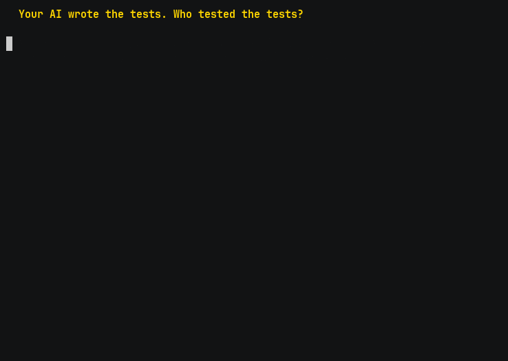

# crucible

**Your AI wrote the tests. Who tested the tests?**

[](https://github.com/Jott2121/crucible/actions/workflows/ci.yml)
[](https://github.com/Jott2121/crucible/actions/workflows/codeql.yml)
[](docs/MUTATION.md)
[](tests/)
[](experiments/RESULTS.md)
[](experiments/RESULTS.md)
[](#receipts-are-the-product)
[](LICENSE)



<sub>Recorded live — every command really ran, and every number in it is read back from that run's
own receipt. Sped up for viewing; [replay the raw cast at real speed](docs/assets/demo.cast).
Full landing page: **[jott2121.github.io/crucible](https://jott2121.github.io/crucible/)**</sub>

That module has **7 passing tests and 97% line coverage**. Mutation testing injects **71 real
defects**. The suite kills 46. **25 survive** — twenty-five real bugs walking straight through a
green build.

crucible kills **24 of the 25**, and then does the more important thing: in two rounds the Critic
wrote tests that **failed on pristine code**, and crucible **threw them out** rather than bank a
kill it hadn't earned. The loop ends `dry` with one mutant still standing, and says so. Mutation
score 65% → 99%; **line coverage never moves off 97% the entire time.** Coverage was never the
thing measuring your safety.

An earlier run on the same module killed all 25 (`clean`). Same tool, same module, different day —
model nondeterminism is real, and the receipts record both rather than only the flattering one.

## Put the number in your own PRs

The diagnose costs nothing and calls no model. Point the Action at a module and every pull request
tells you how many real bugs your suite would actually have caught:

```yaml
- uses: Jott2121/crucible@main
  with:
    module: yourpkg/yourmodule.py    # omit if your repo already configures [tool.mutmut]
    fail-under: "70"                 # optional: red the build below this
```

It comments the score and names the survivors. **No model, no API key, `$0`** — the number that
embarrasses a coverage badge is free to compute, and you should not need a subscription to be told
the truth about your own tests.

For the badge, set `badge-file: mutation.json`, publish it, and point shields.io at it. The payload
lives in **your** repo — there is no badge service of mine sitting in the middle of your CI, and no
uptime I owe you. The badge at the top of this page is generated exactly that way, by this Action,
on this repo:

```markdown
[](...)
```

Or just run it locally, on any repo, right now:

```
crucible score . --module yourpkg/yourmodule.py --coverage 97
97% line coverage, but 25 of 71 injected defects SURVIVED this suite (46 killed, mutation score 65%).
```

Coverage measures what ran, not what would be caught. Mutation testing injects real defects
and counts how many your suite kills — and AI-written suites routinely leave survivors.
crucible closes the loop: a **Tester** agent writes tests, **mutmut** finds the survivors —
injected defects no test caught — and a **Critic** agent is handed the named survivors and
writes tests to kill exactly those. Every verdict is mechanical: pytest kills the mutant or
it survives. **No model ever grades model output.**

## Quickstart — the free first win (no model, no keys, ~10 minutes)

Find out what your existing tests miss, on your own repo:

    git clone https://github.com/Jott2121/crucible && pip install -e "./crucible[dev]"
    cd /path/to/your-repo-clone       # work in a clone: crucible writes scope config
    crucible scope . --module yourpkg/yourmodule.py
    mutmut run && mutmut results      # survivors = injected bugs your tests never caught

`crucible scope` detects your layout, writes the mutation scope, and **proves** a fresh test
file is collectable before anything else runs (a canary probe; it refuses — exit 4 — rather
than guess). No AI is involved yet: the survivor count is plain mutation testing on your suite.

## Then harden — the adversarial loop

    crucible harden . --module yourpkg/yourmodule.py \
        --tester claude-cli --critic claude-cli --runs-dir ~/.crucible-runs/yourrepo

With `claude-cli`, model calls run through Claude Code headless on your Claude subscription —
**$0 metered spend**, and every run's `meta.json` records `billing: max-plan` so plan-covered
shadow dollars are never mistaken for an invoice. No subscription? `--tester anthropic` uses the
metered API via `ANTHROPIC_API_KEY`.

Lean invocation is the default: the subprocess runs with `--tools ""`, collapsing Claude
Code's agent loop to a single completion. On the reference run (`rag_guard/guard.py`), that
took the harden from **439,230 to 3,641 input tokens (120.6×), with identical results — the
same 25/25 surviving mutants killed** (receipts `20260712T050833Z` vs `20260712T171312Z`).
Measured on that run's receipts, not a universal constant. `CRUCIBLE_LEAN=0` restores the
ambient invocation.

## Receipts are the product

Every run writes a receipt directory:

    meta.json         # models, billing (api vs max-plan), lean_isolation rung, scope commit
    receipt.jsonl     # one line per round: tokens in/out, cost, kills, survivors, prompt hash
    result.json       # verdict + totals

Generated tests are written into the working tree of wherever you run it — so run it on a
throwaway branch; the bundled `harden-tests` skill (`.claude/skills/harden-tests/`) enforces
the full ritual: **local branch only, never main, PR strictly opt-in**. If the canary can't
prove your scope, crucible refuses instead of spending tokens.

## Results

The pre-registered experiment (`experiments/PROTOCOL.md`) ran five subjects across three arms
(one-shot, same-lineage adversarial loop, cross-lineage adversarial loop). **H1** — the
adversarial loop kills more mutants than one-shot generation — is **supported**: pooled exact
McNemar p = 4.9×10⁻³², b = 105, c = 0. This **replicates** the direction established by MuTAP,
AdverTest, and Meta's ACH (see `docs/RELATED-WORK.md`) in a new agentic, repo-level, Python
setting — we claim the replication, not the idea. **H2** — a cross-lineage critic beats a
same-lineage critic on missed survivors — is **not supported** (p = 0.0625). An earlier run
showed an enormous H2 effect; the autopsy traced it to silent output truncation rejecting one
arm's rounds — an instrument artifact, not a model difference. That autopsy, and the fail-closed
instrumentation built from it, is the finding. Full tables, all three pre-declared views,
cost-per-kill, and the instrument-repair narrative: [`experiments/RESULTS.md`](experiments/RESULTS.md).

## Why trust this

The claims above are checkable: the experiment was pre-registered before results existed
(`experiments/PROTOCOL.md`), the null is published at the same prominence as the positive
result, the prior art is cited rather than rediscovered (`docs/RELATED-WORK.md`), and the
tool is dogfooded — crucible's own modules run under the same mutation gate, current score
and survivor dispositions in `docs/MUTATION.md`.

## Honest limitations

- Python + pytest repos only; layout heuristics target well-formed projects — a repo the
  canary can't validate is a refusal, not a guess.
- mutmut is pinned exactly (3.6.0): the src-layout shim relies on a mutmut-internal contract.
- The `claude-cli` provider has no mechanical truncation check (the CLI exposes no output
  cap); disclosed in the provider docstring.
- The 120.6× lean result is one module, one apples-to-apples pair of runs. Your ratio will
  differ; your receipts will tell you.

## How it works

    Tester (writes tests) ──> mutmut (injects defects, counts kills)
          ^                        │ named survivors
          └──── Critic (kills exactly those) <──┘   ... until dry or round cap

Built on [oracle-gate](https://github.com/Jott2121/oracle-gate) (survivor triage, provenance,
providers). MIT license.
